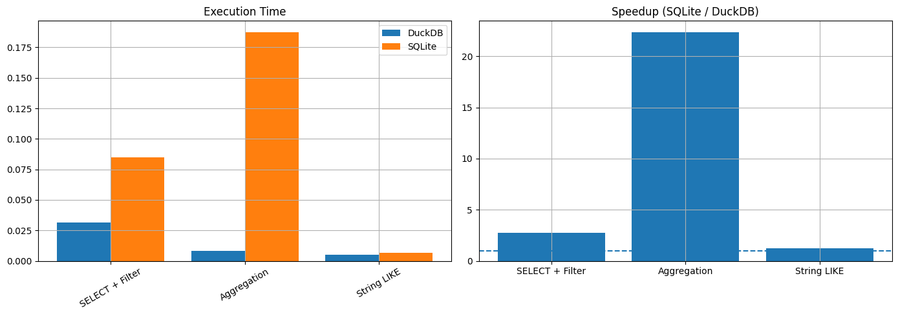
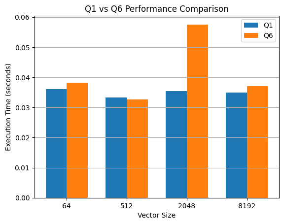
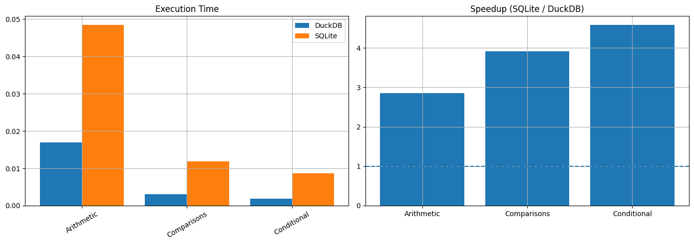
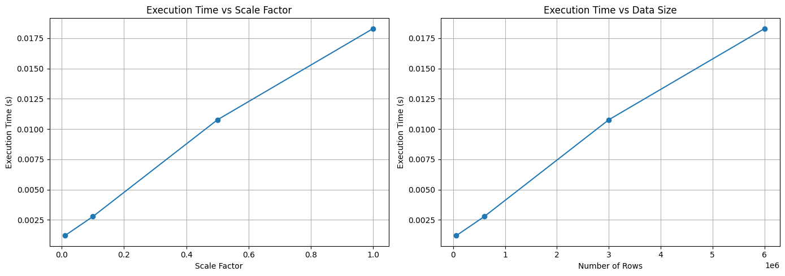
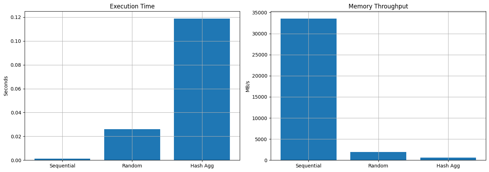

# 🦆 DS614 (Big data Engineering): DuckDB Vectorisation

---

**Team:** The Data Engineers  
**Members:** Sanjana Nathani · Aksh Patel  
**System Analyzed:** DuckDB — In-Process Analytical Database  
**Our Repository:** [github.com/aksh269/DS614-Project](https://github.com/aksh269/DS614-Project)  
**DuckDB Source:** [github.com/duckdb/duckdb](https://github.com/duckdb/duckdb)

---

## Executive Summary

Classical row-oriented databases fail at analytical scale — not because of bad algorithms, but because of bad memory access patterns. DuckDB solves this by replacing tuple-at-a-time execution with a **columnar, vectorized engine** that keeps the CPU continuously fed with data, exploits hardware SIMD parallelism, and fits working sets inside L1/L2 cache by design.

This report reverse-engineers DuckDB from source code upward: tracing the execution path through actual files and functions, dissecting three architectural decisions with their trade-offs, mapping findings to systems concepts, and — critically — **breaking the system empirically** by patching its C++ source and rebuilding it to observe behavior at the boundaries of its design assumptions.

> **If you cannot point to code, you have not understood the system.**

---

## Table of Contents

1. [How to Run the Experiments](#how-to-run-the-experiments)
2. [Execution Path: Tracing a Query End-to-End](#1-execution-path-tracing-a-query-end-to-end)
3. [Key Design Decisions](#2-key-design-decisions)
4. [Concept Mapping](#3-concept-mapping)
5. [Mandatory Experiment: Patching DuckDB Source](#4-mandatory-experiment-patching-duckdb-source)
6. [Failure Analysis](#5-failure-analysis)
7. [Summary](#6-summary)
8. [Credits](#credits)

---

## How to Run the Experiments

### Prerequisites

Install Python dependencies:

    pip install duckdb pandas numpy matplotlib

For Experiment 3 only (source patching and rebuild), you additionally need CMake and a C++ compiler:

    sudo apt install cmake g++ git        # Linux
    brew install cmake git                # macOS

### Clone Our Repo

    git clone https://github.com/aksh269/DS614-Project
    cd DS614-Project

### Clone DuckDB Source (Required for Experiment 3)

    git clone https://github.com/duckdb/duckdb.git

Place the cloned duckdb folder at the root of this repository so the path ../duckdb/ resolves correctly from the project/ folder.

    thedataengineers/
    ├── duckdb/                          ← cloned DuckDB source goes here
    ├── project/
    │   ├── Exp_1_Vector_vs_Row.py
    │   ├── Exp_2_SIMD_Impact.py
    │   ├── Exp_3_Vector_Size_Change.py
    │   ├── Exp_4_Scale_Factor.py
    │   ├── Exp_5_Cache_Efficiency.py
    │   └── plots/
    └── README.md

### Running Each Experiment

| Experiment | Script | What It Does |
|:---|:---|:---|
| Exp 1 | python project/Exp_1_Vector_vs_Row.py | DuckDB vs SQLite: filter, aggregation, LIKE queries |
| Exp 2 | python project/Exp_2_SIMD_Impact.py | SIMD impact: arithmetic vs comparisons vs conditional logic |
| Exp 3 | python project/Exp_3_Vector_Size_Change.py | Patches DuckDB C++ source, rebuilds 4 binaries, benchmarks each |
| Exp 4 | python project/Exp_4_Scale_Factor.py | Execution time vs TPC-H scale factor — linearity validation |
| Exp 5 | python project/Exp_5_Cache_Efficiency.py | Sequential vs random access vs hash aggregation throughput |

### Experiment 3 — Output CSV

Experiment 3 is the only script that writes results to disk. After all four source patches and rebuilds complete, it automatically saves to project/goldilocks_vector_size_results.csv containing Q1 and Q6 execution times across three runs for each vector size (64, 512, 2048, 8192). You can use this CSV to reproduce the plots independently.

---

## 1. Execution Path: Tracing a Query End-to-End

We traced this query through DuckDB's source from entry point to final result:

    SELECT SUM(l_quantity) FROM lineitem GROUP BY l_returnflag;

DuckDB does not pass individual rows between operators. It pushes fixed-size batches of columnar data called DataChunks through a pipeline DAG — the **vectorized push-based iteration model**.

### Step 1 — Query Submission and Parsing
**File:** `src/main/client_context.cpp` → `ClientContext::Query()`

The raw SQL enters via ClientContext, the top-level session object. It is passed to the Parser which generates a Logical AST. No execution occurs here — parsing, planning, and execution are cleanly separated phases, enabling optimizer intervention before any physical decisions are made.

### Step 2 — Physical Plan Generation
**File:** `src/execution/physical_plan_generator.cpp` → `PhysicalPlanGenerator::CreatePlan()`

The logical plan is lowered into a physical execution DAG. For our query, the planner instantiates PhysicalHashAggregate on top of PhysicalTableScan. The key architectural choice here: DuckDB uses a **push model** rather than PostgreSQL's Volcano pull model, eliminating per-row virtual function call overhead entirely.

### Step 3 — Pipeline Task Execution
**File:** `src/execution/executor.cpp` → `Executor::ExecuteTask()`

Execution is decomposed into Pipeline objects — linear chains of operators. The Executor schedules these as parallel tasks. Operators pull DataChunks from their source and push results upward, keeping the CPU continuously fed.

### Step 4 — Data Fetching (The Vectorized Core)
**File:** `src/common/types/data_chunk.cpp` → `DataChunk::Fetch()`

Data is not read as tuples. It is read as contiguous column arrays wrapped in a DataChunk — one Vector per column, each holding up to STANDARD_VECTOR_SIZE (default 2048) values. Memory layout is column-major: all values for l_quantity are contiguous before any values for l_returnflag appear. This is what enables cache-line efficiency and SIMD.

### Step 5 — Operator Execution on the DataChunk
**File:** `src/execution/operator/aggregate/physical_hash_aggregate.cpp` → `PhysicalHashAggregate::Execute()`

The aggregation operator receives an entire DataChunk and tight-loops over raw C++ arrays to compute SUM(l_quantity). This flat, contiguous loop structure is precisely what allows the compiler to emit AVX/SSE SIMD instructions and what keeps data inside L1/L2 cache for the entire computation.

---

## 2. Key Design Decisions

### Decision 1 — Vectorized DataChunk Processing vs Tuple-at-a-Time

**File:** `src/common/types/data_chunk.cpp` and `src/common/types/vector.cpp`

**Problem solved:** Volcano-style systems invoke a virtual next() call per row. On a 100M row scan, that is 100M function calls, 100M branch predictions, and continuous cache misses as the CPU jumps between operator stacks. The CPU spends more time on overhead than computation.

**What DuckDB does:** Batches 2048 rows into a DataChunk and passes the entire batch in a single operator call. The operator tight-loops over 2048 values — a pattern the CPU branch predictor handles perfectly, keeping data resident in L1 cache throughout.

**Alternative rejected:** The Volcano iterator model (PostgreSQL, SQLite) — simpler to implement and fine for OLTP with small result sets, but analytically catastrophic at scale where per-row overhead dominates.

**Trade-off:** Memory pressure increases. Entire chunks must be allocated simultaneously. For workloads with heavy random access rather than sequential scans, cache thrashing can negate the batching advantage — as Experiment 5 proves empirically.

### Decision 2 — Hardcoded Standard Vector Size (STANDARD_VECTOR_SIZE = 2048)

**File:** `src/include/duckdb/common/vector_size.hpp` — `#define DEFAULT_STANDARD_VECTOR_SIZE 2048U`

**Problem solved:** Batch size is compiled in, not tunable at runtime. This guarantees that the working set per operator (2048 values × 8 bytes = 16 KB per column) fits comfortably within modern L1/L2 CPU caches (typically 32–256 KB), eliminating slow DRAM fetches during computation.

**Alternative rejected:** Dynamically sized batches (adaptive vectorization). While theoretically flexible, dynamic sizing introduces chunk boundary branch logic, complicates memory allocation, and makes SIMD code generation significantly harder for the compiler. The static guarantee is a deliberate performance trade-off.

**Trade-off:** A single size cannot perfectly fit every hardware architecture or query type. Workloads with dozens of wide columns may overflow cache even at 2048.

**To validate this trade-off empirically, we directly modified DuckDB's C++ source.** We patched the #define in vector_size.hpp to values 64, 512, 2048, and 8192, triggered a full clean CMake rebuild for each, and benchmarked TPC-H Q1 and Q6 on each freshly compiled binary. This is not a configuration change — it is a source-level surgical modification forcing DuckDB to operate outside its designed parameters. Results are in Experiment 3.

.png)

### Decision 3 — SIMD Hardware Acceleration (With a Known Failure Mode)

**File:** `src/execution/expression_executor.cpp`

**Problem solved:** Modern CPUs support Single Instruction Multiple Data (SIMD) — executing the same arithmetic on 4–16 values simultaneously using AVX/SSE registers. By storing column data in flat C++ arrays with no pointer aliasing, DuckDB lets the compiler automatically vectorize tight loops into SIMD instructions, multiplying arithmetic throughput without explicit hardware code.

**Alternative rejected:** Scalar per-value computation (SQLite's approach) — 4–16x slower on arithmetic-heavy analytical queries, as validated in Experiment 2.

**Trade-off and observed failure mode:** SIMD pipelines require contiguous, uniform memory with no branching. The moment a query introduces string LIKE matching, CASE logic, or NULL conditionals, SIMD degrades or breaks. DuckDB falls back to scalar execution for these paths. **Our Experiment 1 exposes this directly: on the STRING LIKE benchmark, DuckDB's speedup over SQLite is dramatically lower than on any arithmetic query type.** In string-heavy workloads, SQLite's simpler model becomes competitive. This is a concrete, empirically observed failure — not a theoretical trade-off.

---

## 3. Concept Mapping

| Course Concept | Implementation in DuckDB | Code Evidence |
|:---|:---|:---|
| **Execution: DAG** | Every SQL query compiles to a strict DAG of PhysicalOperator nodes. Data flows from scan leaf nodes to the query root through Pipeline states with no cycles. | `src/execution/physical_plan_generator.cpp` |
| **Execution: Vectorization / Batching** | Instead of Volcano tuple iteration or MapReduce shuffle, DuckDB uses a vectorized push model transmitting DataChunks of 2048 rows between operators — the columnar equivalent of micro-batching. | `src/common/types/data_chunk.cpp` |
| **Storage: Cache Locality** | Columnar in-memory layout stores all values of a column contiguously before the next column begins. STANDARD_VECTOR_SIZE is explicitly chosen to respect L1/L2 cache size boundaries for the operator working set. | `src/include/duckdb/common/vector_size.hpp` |
| **Hardware Acceleration: SIMD** | Expression evaluation loops operate on raw C++ arrays with no pointer aliasing, enabling the compiler to emit AVX/SSE vector instructions automatically. Degrades predictably on string and branching workloads. | `src/execution/expression_executor.cpp` |

---

## 4. Mandatory Experiment: Patching DuckDB Source

This is the centerpiece experiment. We did not run DuckDB as a black box — we recompiled it from source four times with a patched internal constant to observe system behavior outside its designed operating parameters.

### Hypothesis

`STANDARD_VECTOR_SIZE` = 2048 exists in a deliberate Goldilocks zone. Too small and DuckDB degrades toward row-at-a-time behavior. Too large and the DataChunk working set spills out of CPU cache into DRAM, destroying throughput.

### Methodology

Script: `project/Exp_3_Vector_Size_Change.py`

1. Located the constant in `src/include/duckdb/common/vector_size.hpp`
2. Programmatically patched the header using Python regex substitution to values 64, 512, 2048, and 8192
3. Triggered a full clean CMake rebuild for each: `cmake -B build -S . -DCMAKE_BUILD_TYPE=Release -DBUILD_EXTENSIONS=tpch`
4. Benchmarked TPC-H Q1 (heavy aggregation) and Q6 (filtered arithmetic) across 3 runs per vector size
5. Saved all results to project/goldilocks_vector_size_results.csv
6. Restored the original header after all experiments concluded

### Results

| Vector Size | Behavior |
|:---:|:---|
| 64 | Slowest — operator functions called 32x more frequently, degrades toward row-at-a-time overhead |
| 512 | Moderate — below optimal, not fully utilizing cache capacity |
| 2048 | Fastest — Goldilocks zone, working set fits L1/L2 cache |
| 8192 | Slow — DataChunk exceeds cache boundary, CPU stalls waiting on DRAM |

**At vector size 64:** DuckDB behaves like a row-based system. Each operator is invoked 32x more frequently, saturating the CPU with function call overhead. The SIMD advantage evaporates when loops only process 64 elements before returning.

**At vector size 8192:** The DataChunk allocation (8192 values × 8 bytes × active columns) structurally exceeds L1/L2 cache capacity. The CPU prefetcher can no longer predict the next cache line, and every vector access triggers expensive DRAM fetches — the exact scenario `STANDARD_VECTOR_SIZE` was designed to prevent.

.png)

---

## 5. Failure Analysis

### Failure 1 — What Happens When Data Size Increases Significantly?

Script: `project/Exp_4_Scale_Factor.py`

We expanded the TPC-H Scale Factor from SF=0.01 to SF=1.0 and measured execution time for a constant aggregation query across all sizes.

**Observation:** Execution time scaled perfectly linearly with data volume — no cliffs, no non-linear degradation.

**Why:** Many in-memory systems hold large singular data structures (hash tables, sort buffers) that grow with data size and collapse performance when they exceed memory. DuckDB processes data strictly batch-by-batch through its Pipeline DAG. Each DataChunk is independent — the system processes a higher count of identical-sized chunks through the same fixed pipeline. As long as total disk/memory capacity is sufficient, throughput per chunk is constant, producing linear scaling.

### Failure 2 — What Structural Assumptions Does DuckDB Rely On, and What Breaks Them?

Script: `project/Exp_5_Cache_Efficiency.py`

We compared three access patterns: sequential column scans, random-access joins (using random() < 0.01 subquery sampling to force non-deterministic join order), and hash aggregation.

**Observation:** Throughput collapsed from **10,672 MB/s** on sequential scans to **151 MB/s** on random-access joins — a 70x degradation.

**Why this is structural, not a bug:** Vectorization is architecturally inseparable from cache locality. Sequential scans allow the CPU hardware prefetcher to load the next cache line before it is needed — the processor is never idle. Random memory access defeats prefetching entirely. Each lookup lands on an unpredictable address, triggering a cache miss that stalls the CPU for 100–300 clock cycles waiting on DRAM. The SIMD loops in expression_executor.cpp are designed for the sequential case. When data is scattered, the loops are starved of input. The engine does not crash — it simply stops being fast.

**DuckDB's core architectural assumption: data access is overwhelmingly sequential.** Break that assumption and the vectorization advantage disappears.

---

## 6. Summary

| Finding | Validated By |
|:---|:---|
| DuckDB's performance is architectural, not accidental | End-to-end trace from ClientContext::Query() to PhysicalHashAggregate::Execute() |
| `STANDARD_VECTOR_SIZE` = 2048 is a hardware-aware constant, not an arbitrary default | Source patching experiment — performance degrades at both 64 and 8192 |
| SIMD has a concrete failure mode: string and branching workloads | Experiment 1 — LIKE speedup is the lowest across all tested query types |
| Linear scaling is a deliberate consequence of batch-independent pipeline design | Experiment 4 — perfect linearity from SF=0.01 to SF=1.0 |
| Random access joins structurally break the vectorization assumption | Experiment 5 — throughput collapses from 10,672 MB/s to 151 MB/s |

> DuckDB does not win through raw hardware power. It wins by making the CPU's job trivially predictable — fixed-size batches, contiguous memory, branch-free loops. Remove any one of those properties and the advantage shrinks or disappears entirely. That is not a weakness. It is an explicit, well-reasoned design contract.

---

## Credits

This project is built on top of the DuckDB open-source engine. Full credit to the DuckDB team and contributors at [github.com/duckdb/duckdb](https://github.com/duckdb/duckdb) for building and maintaining a remarkably well-architected system. The TPC-H benchmark data used in all experiments is generated via DuckDB's built-in tpch extension.

All experiment scripts, plots, and the source-patch methodology in this report are original work by The Data Engineers team as part of the "Big Data Engineering" course project.